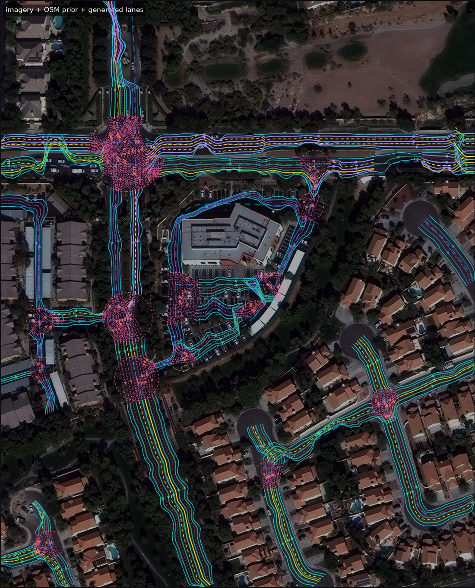

# gmap2lanelet

**Lane-level vector maps from public map data + public aerial imagery, exported as Lanelet2.**

A proof of concept for one hypothesis:

> Using existing road data (OSM) as a **topology prior** and correcting it with
> **geometry observed in aerial/satellite imagery**, a usable lane-level map can be
> semi-automatically generated from public information alone.

The point of this PoC is **not** accuracy. It is to establish, with numbers,
*what can be automated and what cannot* — and to make everything that cannot be
automated visible, georeferenced and reviewable.

Give it a place, get back a Lanelet2 map candidate plus a list of the places a
human has to look at.

```bash
pip install -e ".[lanelet2]"

# a public SpaceNet tile: 0.27 m/px imagery + OSM-like road vectors, no credentials
gmap2lanelet run --image-id 38 --out outputs/vegas38

# anywhere on Earth: OSM via Overpass + an aerial tile service you are licensed to use
gmap2lanelet run --source live \
    --bbox 139.7601 35.6801 139.7649 35.6841 --drive-on left \
    --tiles "https://<your-imagery-host>/{z}/{y}/{x}" --tiles-attribution "..." \
    --out outputs/tokyo

# compare failure modes across many AOIs
gmap2lanelet batch --image-ids 93,162,48,10,100,151,89,38,124,160 --out outputs/batch
```

Each run writes `lanelet2_map.osm`, `viewer.html` (self-contained, offline),
`report.md`, `review_items.json`, `lane_graph.json` and a set of figures.



*Cyan dashed: OSM prior. Yellow: painted lines detected in the imagery (solid /
dashed). Cyan solid: observed road edge. Magenta dotted: virtual boundary, i.e.
no paint was visible and the split is inferred. Green/blue/purple: lane
centrelines coloured by which source decided the lane. Red circles: junctions,
whose interior connectivity is inferred rather than observed.*

---

## The idea

The two public sources fail in *opposite* ways, which is what makes fusing them
worthwhile:

| | OSM / map data | Aerial imagery |
|---|---|---|
| connectivity, one-way, road class | **reliable** | absent |
| lane count | present but often nominal | measurable where paint is visible |
| geometry (position, width, shape) | 1–2 m off, routinely worse | **reliable** |
| lane-level turn permissions | essentially never tagged | not visible at 0.3 m/px |

So the pipeline never asks the imagery what connects to what, and never asks the
map where anything is:

```
OSM / map data ──► topology prior ──┐
                                    ├──► lane graph ──► Lanelet2
aerial imagery ──► geometry evidence┘         │
                                              └──► review items (failure analysis)
```

The mechanism that makes this work is a **road-aligned frame**. Every prior edge
defines a curvilinear coordinate system (arc length `s` along it, lateral offset
`u` across it) and all evidence is rectified into it. Finding lane boundaries
then stops being 2-D curve tracing and becomes 1-D peak finding, and the prior
only has to be right enough to point the cross-section in the right direction —
its position can be, and is, wrong.

## Pipeline

| stage | module | what it does |
|---|---|---|
| acquisition | `sources/` | Overpass / `.osm` file / SpaceNet for the prior; XYZ tiles / SpaceNet for imagery |
| topology prior | `prior/` | project, split ways at shared junction nodes, drop stubs, cluster junctions |
| observation | `observation/` | road-surface probability + lane-marking response (pluggable backend) |
| profiling | `fusion/profile.py` | rectify evidence into the road-aligned frame |
| corridor | `fusion/corridor.py` | find the pavement, correct the prior's lateral error, detect dual carriageways |
| lane structure | `fusion/lanes.py` | lane boundaries from markings, lane count arbitrated against OSM |
| intersections | `fusion/intersection.py` | trim approaches, infer turn connectivity, generate turn lanes |
| assembly | `fusion/builder.py` | stitch lanes into a connected graph |
| export | `export/lanelet2_osm.py` | Lanelet2 OSM-XML with provenance tags |
| QA | `qa/` | failure detection, review items, Lanelet2 round-trip validation |
| viz | `viz/` | static overlays + a self-contained interactive viewer |

**Every element carries `source` and `confidence`.** `Source.OSM` means the map
decided it, `Source.IMAGE` means the imagery measured it, `Source.FUSED` means
they agreed, `Source.INFERRED` means a rule invented it (all intersection
interiors), `Source.DEFAULT` means neither source said anything. These are
written into the exported map as `gm2ll:*` tags, so a reviewer opening it in
JOSM sees where each number came from.

## Results

10 AOIs in Las Vegas (SpaceNet-3, 0.27 m/px, ~316 × 390 m each), 35.8 km of
prior road → **3 118 lanelets / 133 lane-km**.

| | major roads | residential | minor (service, parking aisles) |
|---|---|---|---|
| prior length | 6.0 km | 8.7 km | 17.8 km |
| lane markings observed | **88.7 %** | 62.1 % | 51.8 % |
| lane count agrees with OSM (when markings seen) | 39.4 % | 27.0 % | 9.7 % |
| median geometry correction applied to the prior | 1.41 m | 1.27 m | 1.40 m |

Lanelet2 export: **0 parse errors on all 10 AOIs**, routing graph builds,
84–96 % of lanelets reach a successor or predecessor (median 91 %).

Public-data gaps found: `turn:lanes` present on **0 / 715** prior edges,
`maxspeed` on **0 / 715**.

**What is automatable:** road-surface geometry, the lateral correction of the
prior, lane-boundary geometry where paint is visible, dual-carriageway
detection, and the entire Lanelet2 conversion.

**What is not:** the number of lanes (image and prior disagree on ~60 % of major
carriageways and nothing in public data breaks the tie), and intersection
connectivity (never observable, never tagged — every turn lane in this PoC is
a rule, not a measurement).

Full analysis, including every failure mode with worked examples:
**[docs/RESULTS.md](docs/RESULTS.md)**.

## Documentation

- [docs/RESULTS.md](docs/RESULTS.md) — evaluation, failure catalogue, what to fix next
- [docs/DESIGN.md](docs/DESIGN.md) — architecture and algorithms
- [docs/PRIOR_WORK.md](docs/PRIOR_WORK.md) — DeepAerialMapper, SIO-Mapper, Lanelet2 and what was reused
- [docs/CALIBRATION.md](docs/CALIBRATION.md) — how the two detection thresholds were set

## Install

```bash
pip install -e ".[lanelet2,dev]"
pytest                       # 26 tests, no network required
```

The `lanelet2` extra installs the official Lanelet2 Python bindings, which the
QA stage uses to *actually load* the exported map and build a routing graph from
it. Without it everything still runs; the validation section just reports that
it was unavailable.

## Data sources and licensing

- **SpaceNet-3** imagery and road labels — CC BY-SA 4.0 (Maxar / SpaceNet LLC),
  anonymously downloadable from `s3://spacenet-dataset`. Used as the default
  source because it provides high-resolution imagery *and* an OSM-shaped
  centreline graph for the same footprint with no credentials.
- **OpenStreetMap** via Overpass — ODbL. The reference prior for arbitrary AOIs.
- **Aerial imagery** for `--source live` is whatever tile service you pass;
  no endpoint is hard-coded, because using one would imply a licence you may not
  have.

## Extending

The PoC was built so the planned next steps do not require restructuring it:

- **street-level imagery** (signs, signals, arrows) → a new evidence source
  feeding `Source.IMAGE` attributes onto existing lanes; the lane graph already
  has stable ids and per-element provenance to attach them to.
- **3-D / depth** → `GeoRaster` and the local metric frame are already
  z-agnostic; `PipelineConfig.elevation` is the single place elevation is
  assumed flat.
- **Gaussian splatting / photorealistic environments** → consumes the same
  local metric frame and AOI definition.
- **OpenDRIVE overlay** → a second writer next to `export/lanelet2_osm.py`; the
  `LaneGraph` intermediate representation is format-neutral by construction.
- **human-in-the-loop correction** → `review_items.json` is already the work
  queue, and the exported map carries `gm2ll:review=yes` on low-confidence
  lanelets so JOSM can filter for them.
