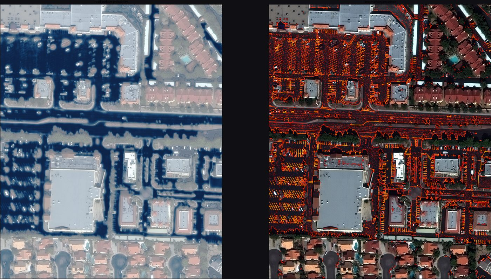
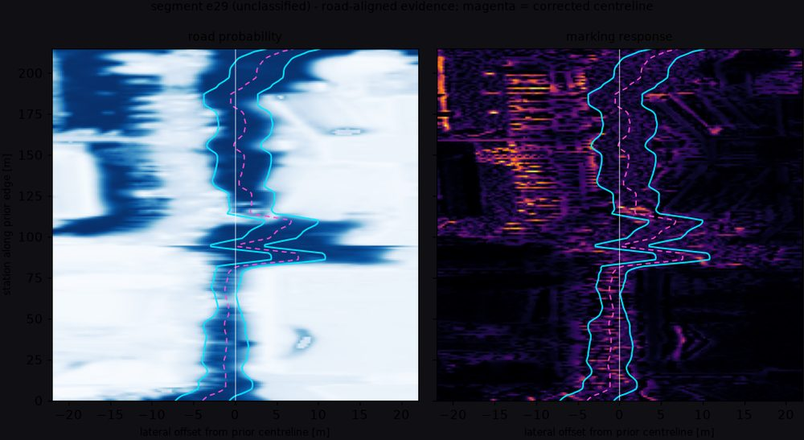

# Results and failure analysis

Evaluation of the PoC on 10 public AOIs, and the answer to each question the
brief asks.

## Setup

| | |
|---|---|
| AOIs | 10 SpaceNet-3 tiles, `AOI_2_Vegas` (img 93, 162, 48, 10, 100, 151, 89, 38, 124, 160) |
| imagery | Maxar WorldView-3 pansharpened RGB, 1300 × 1300 px @ **0.27 m/px**, ≈ 316 × 390 m per tile |
| prior | SpaceNet road centrelines translated to OSM tag keys (`highway`, `lanes`, `oneway`, `surface`) |
| observation backend | `classical-v1` (no pretrained weights — see [DESIGN](DESIGN.md#why-not-a-pretrained-segmentation-model)) |
| prior input | 715 edges, 35.8 km |
| output | 3 118 lanelets (1 215 road + 1 903 turn), 133.0 lane-km |
| runtime | ≈ 4 s per AOI end-to-end on 4 cores (excluding download) |

Reproduce with:

```bash
gmap2lanelet batch --image-ids 93,162,48,10,100,151,89,38,124,160 --out outputs/batch
```



*Left: road-surface probability. It covers the road **and every parking lot** —
correctly, since they are the same asphalt — which is exactly why a topology
prior is needed to decide which of it is carriageway. Right: lane-marking
response.*

## Q1. How far can lane geometry be generated automatically?

**Answer: the lateral geometry, yes. The lane count, no.**

Results are stratified by road class, because aggregating over them is
misleading — in a US suburban tile most prior edges by count are parking
aisles, where "lane markings" are parking-bay stripes and the lane count is
nominal.

| | major | residential | minor |
|---|---|---|---|
| prior length | 6.0 km | 8.7 km | 17.8 km |
| carriageways | 80 | 137 | 278 |
| **lane markings observed** | **88.7 %** | 62.1 % | 51.8 % |
| lane count agrees with prior, given markings | 39.4 % | 27.0 % | 9.7 % |
| median prior correction | 1.41 m | 1.27 m | 1.40 m |

The **geometry correction** is the part that clearly works. The prior sits a
median 1.3–1.4 m off the observed pavement centre (p90 ≈ 3.8 m on the primary
AOI), and the corridor extraction recovers the true centre. On the synthetic
scene, where truth is known, a prior displaced by 3.0 m is corrected to within
**0.25 m** and lane boundaries land on the painted lines to within **0.25 m**
(`tests/test_fusion.py`).

The **lane count** is the weakest output. Where markings were observed on a
major road, image-derived and prior lane counts differ like this:

| image − prior | −3 | −1 | **0** | +1 | +2 | +3 | +4 |
|---|---|---|---|---|---|---|---|
| share | 2.8 % | 9.9 % | **39.4 %** | 28.2 % | 4.2 % | 5.6 % | 9.9 % |

The disagreement is asymmetric — the imagery counts *more* lanes than the prior
about twice as often as fewer — and the large positive outliers all occur on
corridors 20–30 m wide where the prior claims 3–4 lanes. Two explanations are
consistent with the data and **public information cannot distinguish them**:

1. the prior under-reports (a 28 m arterial genuinely has 7 lanes), or
2. the corridor has swallowed a turn pocket, a painted median or a parking bay.

This is the single most important negative result of the PoC. The pipeline
records both counts (`gm2ll:lanes_osm`, `gm2ll:lanes_image`), picks one by an
explicit rule, and raises a `lane_count_conflict` review item every time.



*The pipeline's internal workspace: evidence rectified into the road-aligned
frame (arc length up, lateral offset across). Cyan = extracted corridor edges,
magenta = the corrected centreline. The prior sits at offset 0; the distance
from it to the magenta line is the geometry correction.*

## Q2. How far can intersection topology be recovered?

**Answer: the junction extent, yes. The connectivity, not at all — it is
inferred, and this PoC refuses to pretend otherwise.**

Junctions are located reliably: prior nodes of degree ≥ 3 are clustered within
22 m, which correctly merges the four OSM nodes a divided-road crossing produces
into one physical intersection. Approach geometry is real: each incoming lane's
stub position and heading is measured.

What happens *inside* is a rule:

- `turn:lanes` was present on **0 of 715** prior edges. It is the tag that would
  answer "which lane may turn where", and it does not exist in practice.
- At 0.27 m/px a painted turn arrow is roughly 6 × 15 px and cannot be read.
- The interior of a junction carries no lane markings by design.

So connectivity comes from the near-universal convention — leftmost lane turns
left, rightmost turns right, everything goes through — with lane order preserved
across each manoeuvre. Every lane produced this way is tagged
`Source.INFERRED`, confidence ≤ 0.75, and every junction raises an
`intersection_unresolved` review item (149 across the 10 AOIs).

The result is *structurally* sound — the routing graph builds and turns connect
to real successors — and *semantically* unverified.

## Q3. Is it convertible to Lanelet2?

**Answer: yes, verified with the official library, not just by writing XML.**

| | |
|---|---|
| parse errors (`lanelet2.io.loadRobust`) | **0 / 10 AOIs** |
| routing graph (`RoutingGraph`, vehicle rules) | builds on all 10 |
| lanelets reaching a successor or predecessor | 84.1 % – 95.6 %, median **91.1 %** |

The detail that makes this work is that **Lanelet2 derives successor relations
from shared boundary end points**, not from an explicit relation. Lanes are
therefore stitched to literally identical coordinates before export, adjacent
lanes in a carriageway share one boundary object, and Douglas–Peucker
simplification is forbidden from moving an end point
(`export/lanelet2_osm.py::_keep_ends`). Getting any of these wrong produces a
file that parses perfectly and routes nowhere.

The remaining ~9 % of unconnected lanelets are dominated by parking aisles whose
prior edges are isolated islands inside the tile — correctly disconnected.

## Q4. Where is public information insufficient?

Measured on the 715 prior edges:

| information needed | availability | consequence |
|---|---|---|
| `turn:lanes` | **0 / 715** | all intersection connectivity is a guess |
| `maxspeed` | **0 / 715** | speed limits fall back to class defaults |
| lane count | 715 / 715 tagged, but disagrees with imagery on ~60 % of major carriageways | cannot be trusted, cannot be checked |
| traffic signals / signs / stop lines | not in the prior, not legible at 0.27 m/px | no regulatory elements are exported |
| lane-level markings on dark asphalt | not resolvable at 0.27 m/px in low sun | 11 % of major carriageways have no observable paint |
| carriageway vs parking boundary | ambiguous — same asphalt | 346 `corridor_width_clamped` items |

The blunt version: **0.3 m satellite imagery is enough for road geometry and
marginal for lane markings; it is not enough for anything regulatory.** Lane
markings are 10–15 cm wide, i.e. sub-pixel, and only detectable through their
partial coverage of a pixel. That works on fresh paint over dark asphalt in good
light and fails on worn paint, in shadow, and under tree cover.

## Q5. Can the places needing human correction be detected?

**Answer: yes — 2 009 georeferenced review items across 10 AOIs, one per
detected failure, each with position, severity and the evidence behind it.**

| code | n | meaning |
|---|---|---|
| `low_confidence` | 527 | element confidence below the review threshold |
| `lane_count_conflict` | 486 | markings and prior disagree on lane count |
| `corridor_width_clamped` | 346 | pavement far wider than the class allows (parking bleed) |
| `implausible_geometry` | 185 | self-evidently wrong output (width or self-intersection) |
| `prior_geometry_shift` | 166 | prior displaced > 2 m from observed pavement |
| `intersection_unresolved` | 149 | connectivity inferred, not observed |
| `lane_disconnected` | 69 | lane with no predecessor and no successor |
| `markings_not_observed` | 59 | no paint on a class that should have it |
| `corridor_not_found` | 19 | prior claims a road the imagery denies |
| `lane_count_unverified` | 3 | count taken from the prior with no confirmation |

Plus `pavement_without_prior`, which flags large paved areas the map never
mentions. In these AOIs it fires almost entirely on parking lots — which is the
*correct* answer and is direct evidence that the topology prior is doing real
work: the imagery alone would have mapped every parking aisle as a road.

Every item is written to `review_items.json` with lat/lon, and every
low-confidence lanelet carries `gm2ll:review=yes` in the exported map so a
reviewer can filter for them in JOSM.

## The failure modes, with mechanism

### 1. Geometry drift — `prior_geometry_shift`

The prior is 1–4 m off. **Handled**: the corridor search accepts up to
`max_lateral_shift` (12 m) of prior error and returns the correction. Reported
when it exceeds 2 m, because a large correction is also the signature of the
corridor having locked onto the *wrong* pavement.

*Residual risk*: on a divided road the prior runs down the median. If the median
is paved, the corridor spans both carriageways and the correction is ~0 while
the lane model is wrong. Detected only indirectly, via `corridor_width_clamped`.

### 2. Wrong lane count — `lane_count_conflict`

See Q1. Dominated by wide corridors. The arbitration is explicit
(`fusion/lanes.py::_arbitrate`): markings win when they are self-consistent and
within one lane of the prior; the prior wins when it is explicitly tagged and
the corridor width supports it; the conflict is always recorded.

### 3. Undecidable intersections — `intersection_unresolved`

See Q2. Also fires when a junction has more than four approaches (the manoeuvre
convention has no defensible answer there) and when several exits qualify for
the same manoeuvre, in which case the best-aligned one is chosen and the choice
is written into the item's notes.

### 4. Invisible lane markings — `markings_not_observed`

11 % of major carriageways. The mechanism is sub-pixel paint plus low contrast:
on the img93 arterial the asphalt sits near the bottom of the sensor's range and
the markings are simply not resolvable — verified by inspecting the raw 16-bit
data, not just the display stretch. The pipeline then falls back to an even
split of the corridor by the prior's lane count, marks every interior boundary
`virtual`, and drops confidence to ≤ 0.45.

This is also the failure mode most dangerous to get wrong in the *other*
direction: an early version of the detector normalised the marking response
locally without an absolute floor, which made it amplify sensor grain on bare
asphalt into confident, entirely fictional lane lines. The fix
([CALIBRATION.md](CALIBRATION.md)) is an absolute contrast floor, validated
against a synthetic scene with the paint deleted.

### 5. Prior and imagery contradict each other

Two directions, both detected:

- `corridor_not_found` (19) — the prior has a road, the imagery has no drivable
  surface. In these AOIs: driveways and paths mis-classified in the prior, and
  roads under dense tree cover.
- `pavement_without_prior` — the imagery has pavement the prior omits. Almost
  always parking; occasionally a genuinely missing service road.

### 6. Self-inflicted geometry errors — `implausible_geometry`

Offsetting a polyline further than its radius of curvature folds it into a loop,
which produced lane centrelines that crossed themselves at tight corners. Fixed
in two places — a curvature-derived cap on the total lateral offset
(`fusion/corridor.py`) and a fold-removal pass that preserves the station
correspondence between a centreline and its boundaries
(`fusion/segments.py::_unfold`) — reducing self-intersections on the primary AOI
from 8 to 1. The remainder are reported rather than hidden.

## What I would do next, in order

1. **Resolve the lane-count ambiguity**, the single biggest source of error. The
   cheapest real fix is not better imagery: it is separating "carriageway" from
   "parking/turn pocket" by detecting the *transverse* structure that bays and
   pockets have and lanes do not.
2. **Model medians explicitly.** Dual-carriageway detection exists but only
   fires on a physical gap; a painted median currently merges two carriageways
   into one corridor and inflates the lane count.
3. **Street-level imagery for regulatory content.** Nothing at 0.3 m/px will
   ever produce a stop line, a signal or a turn arrow, and those are what
   Lanelet2 regulatory elements need.
4. **Human-in-the-loop on the existing queue.** `review_items.json` is already
   ordered by severity; the marginal value of one reviewer-hour is currently far
   higher than that of any algorithmic improvement above.
