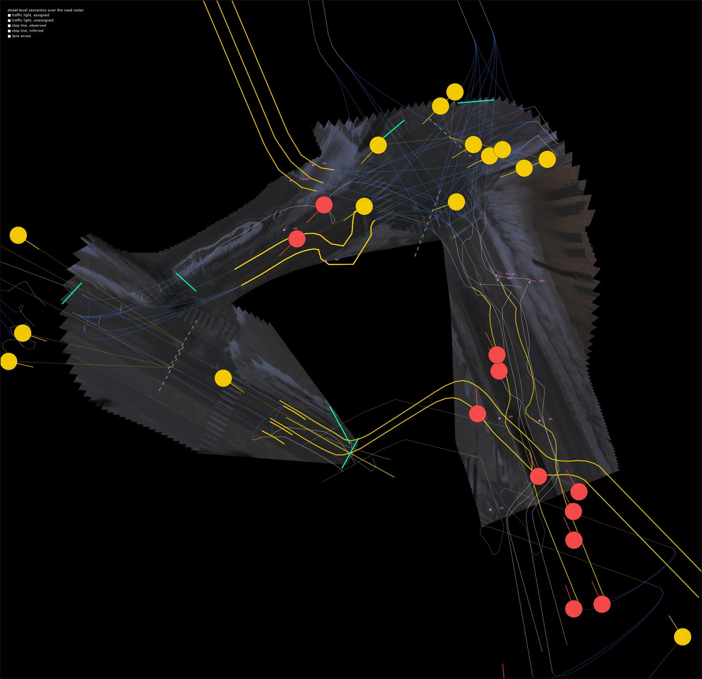
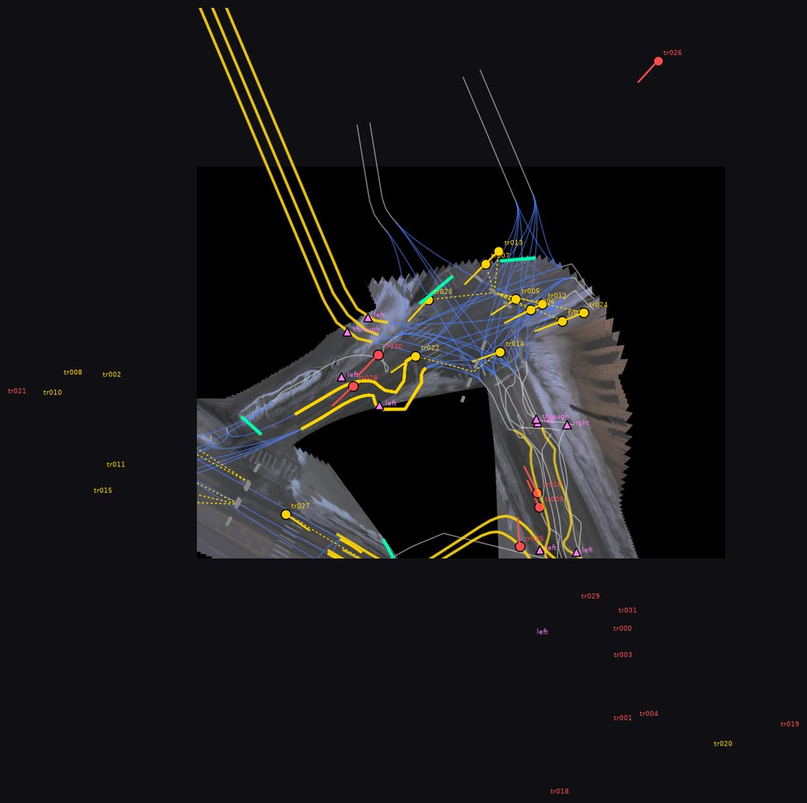
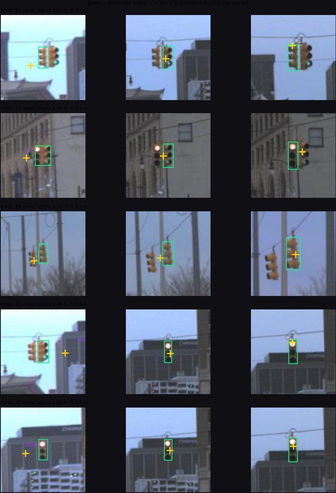

# Street-level semantics: results and failure analysis

Phase 1 answered *where the lanes are*. This is the answer to *what they mean* —
traffic lights, the stop lines they govern, the lanes behind those stop lines,
and the painted arrows that say which way each lane may go.

The role split is unchanged and deliberate:

| input | supplies |
|---|---|
| OSM (or an OSM-equivalent prior) | topology: which roads meet where |
| overhead imagery | road and lane **geometry** |
| street-level imagery | **semantics**: signals, signs, stop lines, arrows |

Street imagery never replaces the lane map. It is evidence *about* it.

## Setup

| | |
|---|---|
| area | Detroit (`DTW`), Argoverse 2 sensor log `20dd185d-b4eb-3024-a17a-b4e5d8b15b65` |
| street imagery | 133 posed `ring_front_center` frames (every 3rd, 1550 × 2048), CC BY-NC-SA 4.0 |
| 3-D context | the log's published ground-height surface, 0.30 m grid, 62 % covered |
| prior | the log's HD map **degraded to OSM information content**: carriageway centrelines simplified to 2 m, a `highway` class, `oneway` — no `lanes`, no `turn:lanes`, no `maxspeed` (65 ways, 2.29 km) |
| detector | YOLOv8m, COCO classes 9 (traffic light) and 11 (stop sign), off-the-shelf weights, no fine-tuning |
| held-back truth | the full HD map: 271 lane segments, 123 junction interiors, 76 carriageways, 22 crossings |
| runtime | 142 s end-to-end on 4 cores (68 s detection, 62 s lane graph, 12 s figures) |

```bash
openmap2lanelet street --log 20dd185d-b4eb-3024-a17a-b4e5d8b15b65 --city DTW \
    --out outputs/street_detroit
```

Everything is fetched from public endpoints and cached: the log and its map from
the Argoverse 2 S3 bucket, the detector weights from the Ultralytics GitHub
release assets.

### Why this experiment is honest

The pipeline is shown only the degraded prior and the camera images. The
lane-level map is opened exclusively by `openmap2lanelet.street.evaluate`, after the
run. That is what makes the geometry and turn-semantics numbers below mean
something — and it is also why the traffic-light numbers are *not* an accuracy
figure (see [below](#traffic-lights-what-cannot-be-scored)).

There is one deviation from phase 1 worth stating plainly: no public overhead
imagery of this block was reachable from this environment, so the overhead
raster is produced by **inverse-perspective-mapping the street frames
themselves** into a 5 cm/px mosaic. That is a stronger geometry input than
27 cm satellite imagery, and a much narrower one — it only exists where the
vehicle drove. Both effects show up in the results.

## The chain, end to end



*Yellow = signal head assigned to an approach, with a dotted tie to the stop
line it governs and the controlled lanes highlighted. Red = located but
unassigned. Green = a stop bar actually observed in the imagery; grey dashed =
placed at the junction edge because none was visible. Pink triangles = painted
arrows. The black area is outside the driven corridor: no imagery, hence no
geometry.*



## 1. Traffic light detection and 3-D geolocation

| | |
|---|---|
| signal heads recovered | **32** (plus 5 stop signs) |
| median views per head | 22 |
| median reprojection error | 9.1 px on a 1550 × 2048 frame |
| median positional σ | 2.24 m |
| median height above ground | 4.79 m (p10–p90: 2.70 – 5.84 m) |
| heads in the 4–8 m mast-arm band | 61 % |
| median nearest-neighbour spacing | 5.03 m |

Association of detections to objects is the hard part, not triangulation: a span
wire carries three or four heads a few metres apart, each seen a hundred times,
and the wrong pairing puts a light in the sky. The approach is seed-and-grow —
triangulate every plausible *pair* taken from frames a useful baseline apart,
cluster the pair estimates in 3-D, then re-collect and re-triangulate every ray
that passes near a cluster, with RANSAC to drop strays. Nothing is promoted from
a single view: a bearing with no baseline is a direction, not a position.

### The audit that is actually available



*Green = the detection; yellow + = the recovered 3-D point projected back into
that frame. Views are spread across the whole observation arc.*

The heights are the strongest independent evidence that the scale is right: the
recovered distribution has a mast-arm/span-wire mode near 5 m and a
pedestrian-head mode near 2.7 m, which is what these streets physically have,
and nothing in the pipeline puts it there — height is measured against the
published ground surface after triangulation, not assumed.

The reprojection figure is also where the limits are visible. At long range the
`+` sits several pixels off the box, which is the σ ≈ 2–3 m showing up: Detroit
signals hang on span wires across wide intersections, and the vehicle approaches
them nearly head-on, so the baseline is almost parallel to the bearing — the
worst geometry for triangulation. 10 of 32 heads are flagged
`traffic_light_weak_geometry` for exactly this reason.

## 2. Traffic light → stop line → controlled lanelets

This is the part the brief asks for, and the part that only exists because the
lane graph is already there.

Association is posed in the **approach frame**, not as a nearest-neighbour
search: at a four-way junction every arm's stop line is within 30 m of every
other arm's signals, so distance alone gets about half of them wrong. Three
constraints break the tie — longitudinal position relative to the stop line,
lateral offset from the approach axis, and **which way the head faces** (the
mean bearing from the light back to the cameras that saw it *is* its facing).

| | |
|---|---|
| approaches modelled | 14, at 4 junctions |
| signal heads assigned | **17 / 32 (53 %)** |
| lanelets governed by a signal | 121 |
| stop lines observed in imagery | 6 of 14 |
| median distance, observed stop bar to nearest crosswalk | **2.48 m** |

The stop-line number is the one to trust most: AV2 does not annotate stop bars,
but it does annotate pedestrian crossings, and a correctly placed stop line sits
a metre or two *upstream* of the crossing it precedes. 2.48 m is exactly that.

### Why 15 heads stayed unassigned

Every one of them is left unassigned *with a stated reason*, which is more useful
than a forced answer:

| reason | n | whose problem |
|---|---|---|
| sits *behind* the only modelled approach at its junction — it is the far-side head of the opposing arm, and that arm produced no lanes | 7 | **phase 1**: the geometry stage found no corridor there |
| mounted at 2.3–3.2 m and off every approach axis — a pedestrian or near-side head, not a lane signal | 6 | neither: correctly excluded |
| best approach scored below threshold (0.18–0.27), 45–49 m past the stop line | 2 | genuinely ambiguous; both flagged `weak_geometry` too |

So the dominant cause of an unassigned signal is not the signal — it is a
missing lane. Where the lane graph has an approach, the signals on it get
attached; where it does not, nothing downstream can help. That is the single
clearest interaction between the two phases that this experiment surfaced.

## 3. Lane arrows and turn semantics

Arrows are read in the lane's own frame from the 5 cm mosaic and classified
geometrically rather than by a learned model: an arrow is a shaft with a head,
and the head of a turn arrow is displaced to one side of the shaft while a
through arrow's is not. Measuring that displacement is interpretable, needs no
training data, and degrades into "unknown" rather than into a confident wrong
answer.

10 lanes carried a readable arrow. 5 of them could be matched to a true lane and
scored against the HD map's actual junction connectivity:

| policy | exact set | mean IoU | precision | recall |
|---|---|---|---|---|
| inferred (phase 1 convention, no observation) | 0.40 | 0.767 | 0.90 | 0.867 |
| observed (painted arrow) | 0.20 | 0.533 | **1.00** | 0.533 |
| union of the two | **0.60** | **0.833** | — | — |

**The painted arrow never claimed a manoeuvre that is illegal (precision 1.00)
but recovered only about half of the legal ones (recall 0.53).** A single
symbol is evidence that a manoeuvre *is* permitted; it is not evidence that the
others are forbidden — the lane may carry a combined symbol, or a second symbol
further back that this pass missed. Read that way, the arrows and the
convention are complementary, and their union beats either alone.

This is why `apply_arrows` deliberately does **not** overwrite connectivity. It
attaches both sets to the lane and raises `arrow_contradicts_inferred_turns`
(9 lanes here) as a review item. Silently deleting a legal manoeuvre because one
arrow did not mention it would be the worst outcome available.

## 4. Lanelet2 export with regulatory elements

Validated by loading the file with the real Lanelet2 library, not by inspecting
the XML:

```
parsed:                 yes, 0 parse errors
points / linestrings:   1253 / 224
lanelets:               113
regulatory elements:    17   (subtype=traffic_light)
lanelet → regelem links: 121, every one of which resolves to a stop line
routing:                113 passable, 86.7 % non-isolated
```

The mapping is direct because Lanelet2 already models exactly this relation: the
regulatory element holds the signal (`refers`) and the line where a vehicle must
stop (`ref_line`), and each governed lanelet carries it with role
`regulatory_element`. Turn lanes through the junction inherit the signal from
their approach.

**Only assignments that survived association are exported.** A head whose
controlled lanes could not be decided is not written as a regulatory element —
that would silently claim knowledge the pipeline does not have. It stays in
`street_review.json`.

Every element keeps its provenance:

```xml
<relation id="1234">
  <member type="way" ref="1200" role="refers"/>
  <member type="way" ref="1210" role="ref_line"/>
  <tag k="type" v="regulatory_element"/>
  <tag k="subtype" v="traffic_light"/>
  <tag k="gm2ll:source" v="street_imagery"/>
  <tag k="gm2ll:confidence" v="0.63"/>
  <tag k="gm2ll:reason" v="11 m past the stop line, 1 m left of the axis"/>
  <tag k="gm2ll:landmark" v="tr005"/>
</relation>
```

## 5. What the street layer did *not* fix

| quantity | value | reading |
|---|---|---|
| lane geometry, median lateral error vs truth | 1.28 m | 5 cm imagery does not fix a prior that is 2.8 m off |
| lane geometry, p90 | 4.11 m | the tail is where the corridor was mis-found |
| samples with no true lane within 6 m | 33 % | mostly lanes extrapolated outside the driven corridor |
| lane count exact | 39 % | |
| lane count within ±1 | 87 % | |
| lane count mean signed error | −0.09 | no systematic over- or under-counting |
| junction clusters in the prior | 6 | |
| junctions resolved into turn lanes | 4 | 2 arms never driven ⇒ no corridor ⇒ no junction |

Lane counts did **not** improve over phase 1 in the way one might hope, and the
reason is instructive: `carriageways_with_lane_count_conflict` is 71 %, but with
`lanes_tag=none` there is no OSM count to conflict *with* — the conflict is
between the image count and the class default. Re-running with
`--lanes-tag class` or `--lanes-tag true` isolates how much of the residual
error is the prior's and how much is the observation's.

## Failure modes, ranked

The run emits 48 street-layer review items on top of phase 1's 153, each with a
position and an explanation:

| code | n | severity | what it means |
|---|---|---|---|
| `traffic_light_unassigned` | 15 | high | located in 3-D, but no approach could be shown to be the one it governs |
| `traffic_light_weak_geometry` | 10 | medium | short baseline or few views: position may be metres out even where the association is right |
| `arrow_contradicts_inferred_turns` | 9 | high | the paint and the intersection model disagree about what this lane may do |
| `arrow_repeats_disagree` | 5 | medium | repeated symbols in one lane classify differently: one blob is probably not an arrow |
| `stop_line_inferred` | 5 | medium | no transverse marking visible; the stop line is a convention, not a measurement |
| `traffic_light_approach_ambiguous` | 4 | high | two approaches score within 15 % of each other |

## What is automatable from public data, and what is not

**Automatable, at usable quality**

* detecting signal heads in posed street imagery — an off-the-shelf COCO
  detector is sufficient, no fine-tuning was needed;
* recovering their 3-D position to a couple of metres, *and knowing when that
  number is unreliable* — the σ, baseline and view count are all reported and
  they correlate with the visible reprojection error;
* placing a stop line where a bar is painted and visible: 2.5 m from the
  crosswalk it precedes, which is the right answer;
* attaching signal → stop line → lanelets as a Lanelet2 regulatory element that
  the real library loads and routes over.

**Not automatable from public data alone**

* **Which movement a signal controls.** A left-turn arrow signal and a through
  signal on the same mast arm are the same object to the geometry; separating
  them needs the *lens state* (arrow vs ball), which is a classification problem
  this PoC does not attempt and which one 1550 px frame at 40 m does not
  reliably support.
* **Complete turn permissions.** Arrows give precision, not recall (above). The
  complete set needs either every symbol in the lane read correctly or a signal
  head whose aspect is understood.
* **Anything outside the driven corridor.** The single largest failure driver
  here is not recognition at all: 33 % of generated geometry has no true lane
  near it, 2 junctions of 6 produced no turn lanes, and 6 of 15 unassigned
  signals are unassigned purely because their arm was never driven. Street
  imagery is a *linear* sample of a *planar* problem.
* **Signal grouping.** Four heads on one mast arm displaying the same aspect are
  one regulatory element in reality and four here. Grouping them needs the
  aspect state, same as above.

**The honest summary**: street-level imagery converts "there is a junction here,
topology unknown" into "there is a junction here, with these stop lines, these
signals, and these lanes behind them, at these confidences" — for the arms the
vehicle actually drove. It does not rescue geometry the overhead stage did not
find, and it does not close the intersection-connectivity question on its own.

## Traffic lights: what cannot be scored

Argoverse 2 annotates lanes, junction connectivity and crossings. It does
**not** annotate traffic lights. Neither do the other openly-licensed datasets
that ship posed street imagery with accurate poses.

So there is no positional ground truth for the 32 heads recovered here, and this
document does not print one. What it prints instead is the evidence: view
counts, baselines, reprojection residuals, positional σ, the height distribution
against an independently-published ground surface, and the reprojection figure.
Reporting a fabricated accuracy number would be worse than reporting none.

This is itself a finding about public data: **signal ground truth is the
scarcest thing in this whole problem.** The imagery to find them is public, the
poses are public, the lane map to attach them to can be generated — the labels
to check them against are not.

## Reproducing and extending

```bash
# the run in this document
openmap2lanelet street --out outputs/street_detroit

# how much of the residual lane-count error is the prior's?
openmap2lanelet street --lanes-tag true  --out outputs/street_true
openmap2lanelet street --lanes-tag class --out outputs/street_class

# a different city / junction geometry
openmap2lanelet street --log <log-id> --city ATX --out outputs/street_austin
```

Outputs:

| file | contents |
|---|---|
| `lanelet2_map_semantic.osm` | the map with regulatory elements |
| `semantics.json` | every landmark, stop line, arrow and assignment with provenance |
| `street_review.json` | the 48 items above, with positions in WGS84 |
| `evaluation.json` | every number in this document, per element |
| `viz/semantics.png`, `viz/landmark_check.png` | the figures above |

The street layer is structured so the next inputs drop in without rework:
`StreetImagerySource` needs only posed frames (Mapillary, KartaView, a dashcam
with GNSS/INS), `GroundSurface` takes any raster DEM, and `Detector` takes any
box detector. A sign-classifier or a signal-aspect classifier would attach to
the same `Landmark` objects and immediately inherit the association, export and
review machinery.
